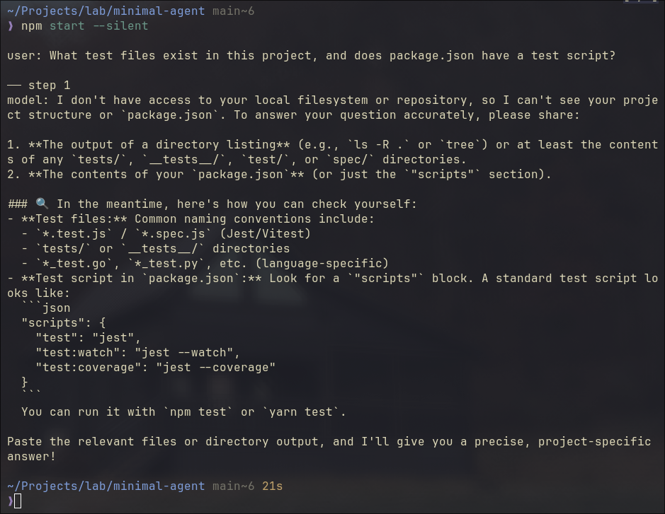
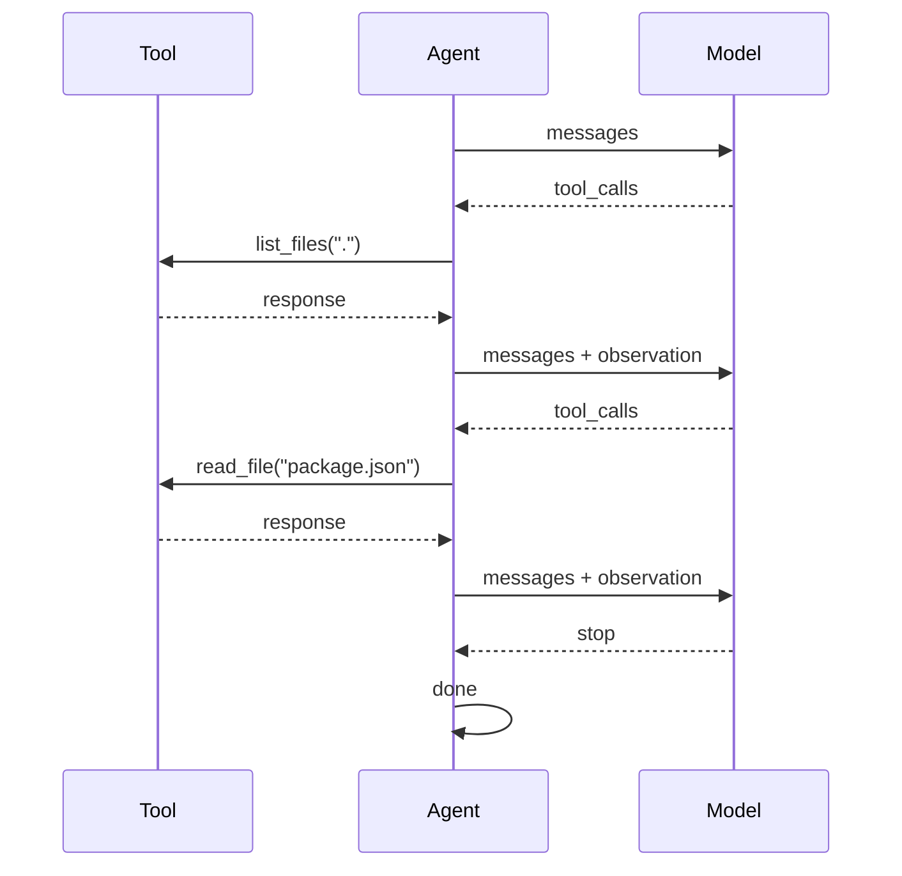
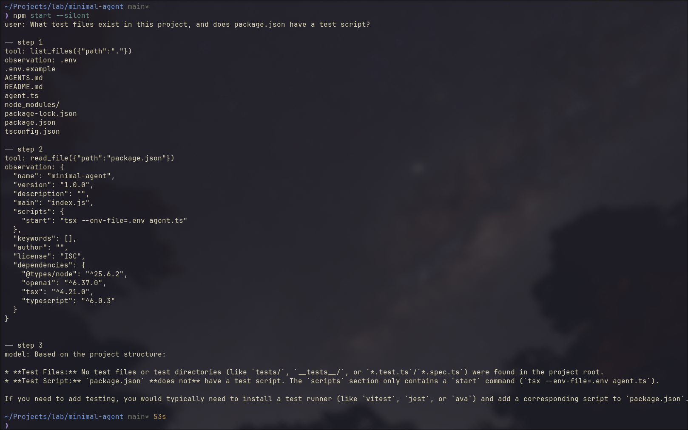
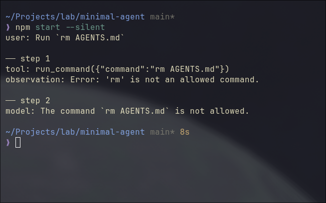
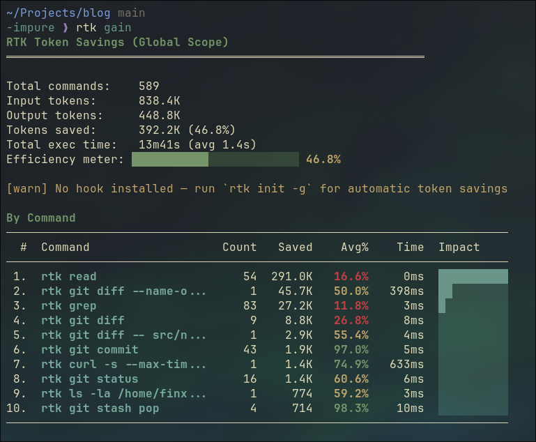
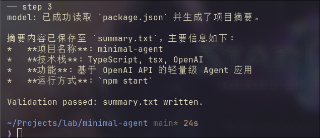
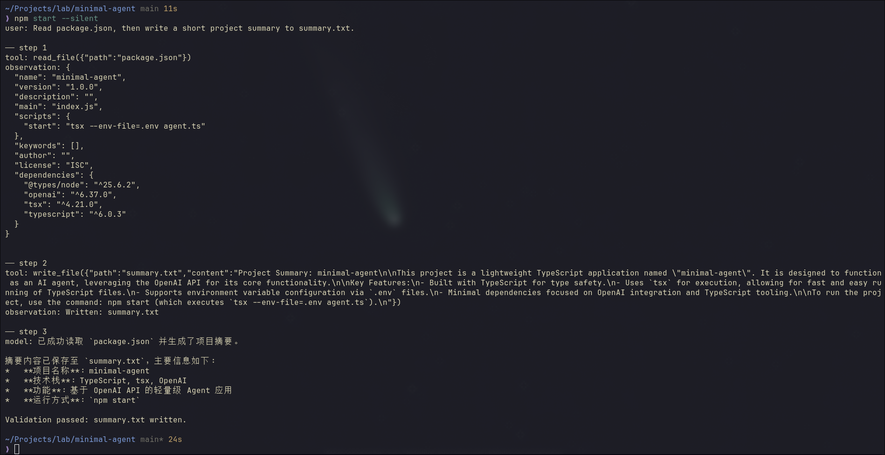
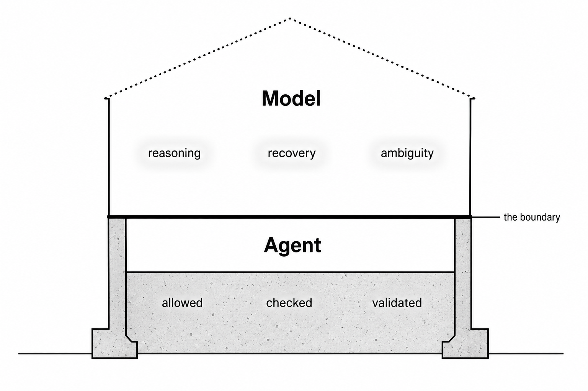
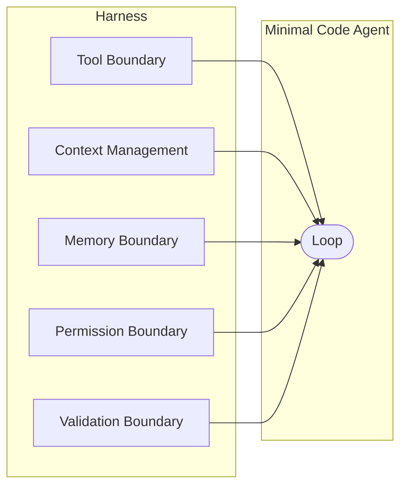

# Build a Minimal LLM Code Agent: From Loop to Harness

> "You can outsource thinking, but not understanding."
>
> - Andrej Karpathy

You've heard "code agent" and "harness" a hundred times this year, but do you know how it works? Could you build it in code?

Most people can't. The words are borrowed, not earned.

This article earns them. We build a minimal LLM code agent from scratch in TypeScript, step by step. By the end, you won't just know the vocabulary. You'll know the skeleton underneath it.

The code is built in 30 minutes. The understanding takes the whole article. That's the point.

---

**TLDR:** A code agent is a loop. The loop calls a model, runs tools, and repeats until done. What makes it production-ready is the harness around it: boundaries for tools, context, memory, permissions, and validation. This article builds both from scratch, in TypeScript, milestone by milestone.  Source code: [minimal-agent](https://github.com/xixiaofinland/lab/tree/main/minimal-agent).

---

## Milestone 1: The Loop

Strip everything away. What is a code agent at its core?

A loop in `runAgent()`. That's it.

```typescript
import OpenAI from "openai";

const client = new OpenAI({
  baseURL: process.env.OPENAI_BASE_URL ?? "https://api.openai.com/v1",
  apiKey: process.env.OPENAI_API_KEY ?? "none",
});

const MODEL = process.env.MODEL ?? "gpt-4o-mini";

async function runAgent(task: string) {
  const messages: OpenAI.ChatCompletionMessageParam[] = [
    { role: "user", content: task },
  ];

  console.log(`user: ${task}`);

  for (let step = 0; step < 5; step++) {
    console.log(`\n── step ${step + 1}`);

    // action 1;
    const response = await client.chat.completions.create({
      model: MODEL,
      messages,
    });

    // action 2;
    const message = response.choices[0].message;
    messages.push(message);

    // strip <think>...</think> blocks for display only
    const display = message.content
      ?.replace(/<think>[\s\S]*?<\/think>/g, "")
      .trim();
    console.log("model:", display);

    // action 3;
    if (response.choices[0].finish_reason === "stop") {
      return message.content;
    }
  }

  return "Stopped: step limit reached.";
}

const task =
  "What test files exist in this project, and does package.json have a test script?";

runAgent(task);
```

It sends this exact task to the code agent, `"What test files exist in this project, and does package.json have a test script?"`, then calls `runAgent(task)` to start the loop.

Three things happen in each iteration:

1. `action 1`: call the model with the current message history
2. `action 2`: push the reply into history, print a cleaned version to the terminal
3. `action 3`: if the model is done, return; if not, loop


The code above is not pseudocode. You can run it. I run against a local Qwen3.6 35B LLM, but any openai API compatible ones would go, such as gpt-4o-mini with your openai API key.



Several subtle details worth mentioning:

The task hints the model toward tools like `list_files` and `read_file`. But none are defined yet. So the model reasons from its own knowledge, does its best, and signals `stop` after one single step. No looping. Not yet. This is how ChatGPT browser version works.

`finish_reason` in action 3 isn't always `"stop"`. `"length"` means output hit the token limit, cut off mid-thought. `"content_filter"` means it was blocked. Production handles all of them explicitly. In this demo, we assume it's always the happy path.

That `step < 5` guard is not cosmetic. A confused model won't stop itself. The step limit is the first harness piece, already baked in.

---

## Milestone 2: Tools

Now give it eyes (tools).

Tools are not system prompt tricks. They're a structured contract. The code agent passes a list of tool definitions alongside your messages. The model reads the descriptions and decides which one to call.

```typescript
// ... imports, client, MODEL same as before

// ── Tool definitions (what the model sees)
const tools: OpenAI.ChatCompletionTool[] = [
  {
    type: "function",
    function: {
      name: "list_files",
      description: "List files and directories at a given path.",
      parameters: {
        type: "object",
        properties: {
          path: { type: "string", description: "Directory path to list." },
        },
        required: ["path"],
      },
    },
  },
  {
    type: "function",
    function: {
      name: "read_file",
      description: "Read the contents of a file.",
      parameters: {
        type: "object",
        properties: {
          path: { type: "string", description: "File path to read." },
        },
        required: ["path"],
      },
    },
  },
];

// ── Tool implementations (what actually runs)
function list_files(filePath: string): string {
  const entries = fs.readdirSync(filePath, { withFileTypes: true });
  return entries
    .map((e) => (e.isDirectory() ? `${e.name}/` : e.name))
    .join("\n");
}

function read_file(filePath: string): string {
  return fs.readFileSync(filePath, "utf-8");
}

function runTool(name: string, args: Record<string, string>): string {
  if (name === "list_files") return list_files(args.path);
  if (name === "read_file") return read_file(args.path);
  return `Unknown tool: ${name}`;
}

// ── Agent loop
async function runAgent(task: string) {
  // ... messages setup same as before
  for (let step = 0; step < 5; step++) {
    const response = await client.chat.completions.create({
      model: MODEL,
      messages,
      tools, // <-- added
    });

    const message = response.choices[0].message;
    messages.push(message);

    if (response.choices[0].finish_reason === "tool_calls") {
      const toolCall = message.tool_calls![0];
      const args = JSON.parse(toolCall.function.arguments);
      const observation = runTool(toolCall.function.name, args);
      messages.push({
        role: "tool",
        tool_call_id: toolCall.id,
        content: observation,
      });
    } else {
      // ... print and return same as before
    }
  }
}

// ... task and runAgent(task) same as before
```

Think about how you'd solve this yourself.

You'd list the files first to get your bearings. Then open the specific file you need.

The model does the same. It calls `list_files(".")`, scans the result, then calls `read_file("package.json")`. Two steps. Then it has what it needs and signals `stop`.

The diagram shows exactly that.



The code running result:

Steps 1 and 2 follow the same pattern: the model requests a tool call, the agent runs it and sends the observation back.

Step 3 is different. No tool call. The model has enough context now and answers directly. That's the `stop` signal, and the final answer prints.



Think of tools as sensors in an IoT system. They sample the environment and send readings back. The model, like a controller, makes decisions based on what it receives.

Feed it accurate readings, it reasons correctly. Feed it wrong ones, it reasons confidently in the wrong direction. The model has no way to tell the difference. It just processes what arrives.

You could return fake data. Wrong file contents. A made-up directory listing. The model would accept it, reason over it, and answer confidently. No verification.

The quality of the agent's output is only as good as the observations its tools return.

---

## Milestone 3: Tool Boundary

Now add `run_command`. The model can execute shell commands.

`list_files` and `read_file` use Node's `fs` module. You're calling well-defined Node APIs. Node handles the underlying OS interaction, and the security contract is clearly scoped: read the filesystem, nothing else.

`run_command` is different. It hands a string to the shell and lets the shell decide what happens. No guardrails. Any binary, any argument, any side effect. That's a different layer entirely, and it needs a different trust model.

```typescript
// ... imports, client, MODEL, tools, list_files, read_file, runAgent same as before

const ALLOWED_COMMANDS = ["ls", "cat", "echo", "node", "npm", "rg"];

function run_command(command: string): string {
  const binary = command.trim().split(/\s+/)[0];
  if (!ALLOWED_COMMANDS.includes(binary)) {
    return `Error: '${binary}' is not an allowed command.`;
  }
  return execSync(command, { encoding: "utf-8" });
}

const task =
  "List the files in this directory, read package.json, and run `node --version`.";

runAgent(task);
```

Notice the whitelist? It is the guardrail we build. The model can reach the shell, but only through these specific doors. If we send the task to run `rm AGENTS.md`, agent would refuse it as below.



The code run above has the task: "Run `rm AGENTS.md`", and it has two steps.

Step 1: the model calls `run_command("rm AGENTS.md")`. It doesn't know `rm` is blocked. The whitelist fires, returns an error string as a normal observation. Step 2: the model reads it and reports back.

Two subtle points I'd like to point out.

**First: the model doesn't build the guardrail. The agent does.** The model still tried to run `rm`, no hesitation, no special awareness. Your code intercepted it. You can't rely on the model to protect you from itself. The boundary has to live in the harness.

**Second: real harnesses return richer observations.** Our `run_command` returns a plain string. Production systems return exit codes, stderr separated from stdout, truncation markers. Without exit codes, the model can't tell "command ran and produced nothing" from "command failed silently." Feed it thin observations, it fills the gaps with guesses.

---

## What a Real Agent Needs

The loop is running. It can list files, read files, run commands. The demo works.

But "works in a demo" is not the same as "works on real tasks." Run this code agent on anything non-trivial and four specific things will break:

1. **Context overflows.** Long tool observations grow the message array. Hit the token limit, the API throws.
2. **No memory.** Close the terminal, restart, it knows nothing about your project.
3. **Unchecked commands.** No confirmation before running something irreversible.
4. **False completion.** The model says "done." Nothing was actually written or tested.

These aren't hypothetical. Each one is a failure mode you will hit. The next four milestones add a boundary for each.

---

## Milestone 4: Context Management

Context isn't just a technical limit. It's everything the model can see right now.

Transformers don't attend equally across the context. The model pays more attention near the start and near the end. Bury something in the middle and the model struggles to reach it. The longer the context, the harder the attention. Researchers call this the "lost in the middle" problem.

So the goal isn't just "stay under the limit." It's "keep the right things visible."

That means three operations: pick what goes in, remove what's useless, condense what's redundant. Each is a judgment call. Each is hard. Together, they look a lot like the old embedded discipline: limited RAM, everything competing for it, no room for waste. The constraint is different. The problem shape is the same.

In our demo, we take the simple approach: truncate anything too long.

```typescript
const raw = await runTool(toolCall.function.name, args);
const observation =
  raw.length > 2000 ? raw.slice(0, 2000) + "\n[...truncated]" : raw;
```

This is a blunt instrument. It works for a demo. In production, you'd summarize instead: call the model again on just the observation, get a condensed version, push that. Tools like [RTK](https://github.com/rtk-ai/rtk) solve this at the CLI layer, compressing the tool call result before it ever reaches the model.

A side note, the screenshot below is my RTK session summary for ~2 week usage. 589 commands run, 392K tokens saved. That's 46.8% of input tokens eliminated before the model ever saw them.



One broader observation worth making here: CLI tools are starting to evolve toward output that code agents can read efficiently. `ls` returning 200 lines of noise made sense when a human was reading it. When a code agent reads it, that's wasted tokens. RTK is a shim for the transition period. Long-term, tools will output compact, structured data natively. The same shift happened to APIs when mobile came along.

---

## Milestone 5: Memory Boundary

Context is what's in the `messages` array right now. Memory is what survives closing the terminal.

Add an `AGENTS.md` to the project root:

```markdown
# Project Rules

Always respond in Simplified Chinese (简体中文).
```

Load it as a system message at startup:

```typescript
function loadMemory(): OpenAI.ChatCompletionMessageParam[] {
  try {
    const rules = fs.readFileSync("AGENTS.md", "utf-8");
    return [{ role: "system", content: rules }];
  } catch {
    return [];
  }
}

const messages = [...loadMemory(), { role: "user", content: task }];
```

Run the same task as before. The model now responds in Chinese. Delete `AGENTS.md`, run again: English. The difference is visible in one line.

Trust me, those are proper Chinese. The agent isn't broken. 😄



Continuity across sessions.

For personal agents, memory isn't a feature. It's the whole point. Projects like [OpenClaw](https://openclaw.ai) and [Hermes](https://github.com/NousResearch/Hermes) are built around this: an assistant that knows your preferences, your history, your context. Context is temporary. Memory is what makes it yours.

Which is why memory management is the harder problem. Context management asks: what should the model see right now? Memory management asks: what's worth keeping at all? What to store. What to discard. When to surface it. How to retrieve the right piece without loading everything.

Nobody has fully solved this. It's one of the most active areas in agent research. Some draw the parallel to human sleep: one leading theory holds that sleep is when the brain consolidates the day's experiences, strengthening useful patterns and discarding the rest. We don't yet have that for LLMs. The framing is the same. The solution isn't.

---

## Milestone 6: Permission Boundary

`run_command` has a whitelist. That's the outer gate. But some commands in the whitelist are still risky. `npm install`, `npm run build` — these change state.

Add a second tier: commands that require confirmation before running.

```typescript
const AUTO_COMMANDS = ["ls", "cat", "echo", "node", "rg"];
const CONFIRM_COMMANDS = ["npm"];

async function run_command(command: string): Promise<string> {
  const binary = command.trim().split(/\s+/)[0];
  if (!AUTO_COMMANDS.includes(binary) && !CONFIRM_COMMANDS.includes(binary)) {
    return `Error: '${binary}' is not an allowed command.`;
  }
  if (CONFIRM_COMMANDS.includes(binary)) {
    const approved = await ask(`Allow: ${command} ? (y/n) `);
    if (!approved) return "User denied the command.";
  }
  return execSync(command, { encoding: "utf-8" });
}
```

Three tiers: auto, confirm, deny. The model doesn't know which tier a command is in. It just calls the tool. Your code decides what happens next.

This is the same design Claude Code uses. Anthropic documented the tension: ask for every write and run command, and users get approval fatigue. Never ask, and you amplify risk. Their production answer involves a classifier that identifies truly risky actions. Our demo answer is a simple tier list. The principle is identical: the permission boundary keeps the model from being the last line of defense.

---

## Milestone 7: Write and Validate

A code agent that can only read and run is half an agent. It can answer questions. It can't produce things. Add `write_file`.

```typescript
function write_file(filePath: string, content: string): string {
  fs.writeFileSync(filePath, content, "utf-8");
  return `Written: ${filePath}`;
}
```

The signal is simple: the tool returns on success, throws on failure. `"Written: summary.txt"` means it worked. The loop closes. That's the first layer of validation: the agent knows the write succeeded.

The second layer runs after the agent finishes. Check independently.

```typescript
runAgent(task).then(() => {
  const ok =
    fs.existsSync("summary.txt") &&
    fs.readFileSync("summary.txt", "utf-8").trim().length > 0;
  console.log(
    ok
      ? "\nValidation passed: summary.txt written."
      : "\nValidation failed: summary.txt missing or empty.",
  );
});
```

Two tiers. The tool return closes the inner loop. The external check closes the outer one. "Done" is not a feeling. It's evidence.

Models are excellent at sounding confident. That confidence has no relationship to whether the work was actually done. Traditional CI fails loudly with logs. A code agent can succeed quietly and lie. Both checks are what makes completion mean something.

How do Claude Code and Codex handle this on longer tasks? Same principle at scale: check exit codes, run the test suite, read back files they just wrote. Claude Code's Todo system marks tasks complete only after the environment confirms, not after the model claims. The exact mechanisms for complex multi-step recovery are still an active area.

This is the final version of the demo. Let's run it.



The agent reads `package.json`, writes the summary to `summary.txt` in English, then responds in Chinese (AGENTS.md is still loaded). The external check confirms the file is written. Read, write, memory, validation: the full harness, working together.

---

## The Model Inside the Loop

The harness is fixed while we can swap the model like [OpenCode](https://opencode.ai/) and [pi](https://pi.dev/) do.

`Qwen3.6 35B` I use chains tools correctly, recovers from failures, and produces useful output. A weak 1B model hallucinates file paths, stops after one tool call, or returns empty content.

That's the separation this demo was built to show, and honestly it's the thing I find most clarifying about building this yourself. The model defines the ceiling: how far it can reason, how well it recovers, how much ambiguity it can handle. The agent defines the floor: what's allowed, what gets checked, what can't go wrong even if the model tries.



You can't train the expensive model. But you can build the code agent. The harness is just code. That boundary is worth holding onto.

---

## Wrap Up

Look at what we built:



Claude Code is this. Codex is this. Every serious code agent framework is this. The loop is always simple. The work is always in the boundaries.

Build it yourself. Feel each piece land. Then when someone says "Claude Code uses a harness layer," you won't nod along. You'll know exactly what they mean.

That's the understanding Karpathy was talking about. You can't outsource it.

Source code: [minimal-agent](https://github.com/xixiaofinland/lab/tree/main/minimal-agent).
