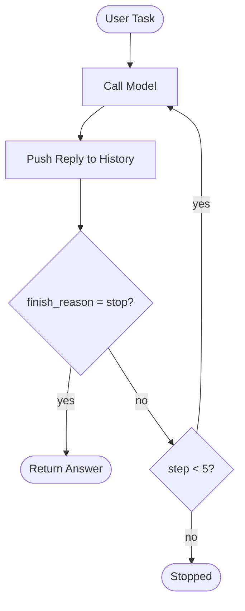
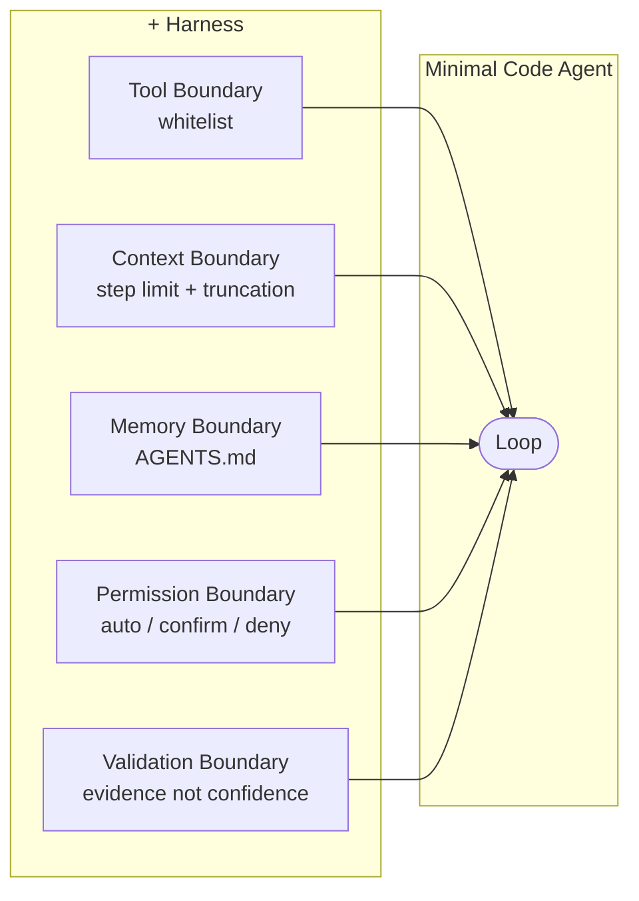

# Build a Minimal LLM Code Agent: From Loop to Harness

> "You can outsource thinking, but not understanding."
>
> - Andrej Karpathy

You've heard "code agent" and "harness" a hundred times this year, but do you know how it works? Could you build it in code?

Most people can't. The words are borrowed, not earned.

This article earns them. We build a minimal LLM code agent from scratch in TypeScript, step by step, milestone by milestone. By the end, you won't just know the vocabulary. You'll know the skeleton underneath it.

The code is built in 30 minutes. The understanding takes the whole article. That's the point.

> Full source: [minimal-agent](https://github.com/xixiaofinland/lab/tree/main/minimal-agent)

---

## Milestone 1: The Loop

Strip everything away. What is a code agent at its core?

A loop in `runAgent()`. That's it.

```typescript
import OpenAI from "openai";

const client = new OpenAI({
  baseURL: process.env.OPENAI_BASE_URL ?? "https://api.openai.com/v1",
  apiKey: process.env.OPENAI_API_KEY ?? "none",
});

const MODEL = process.env.MODEL ?? "gpt-4o-mini";

async function runAgent(task: string) {
  const messages: OpenAI.ChatCompletionMessageParam[] = [
    { role: "user", content: task },
  ];

  console.log(`user: ${task}`);

  for (let step = 0; step < 5; step++) {
    console.log(`\n── step ${step + 1}`);

    // action 1;
    const response = await client.chat.completions.create({
      model: MODEL,
      messages,
    });

    // action 2;
    const message = response.choices[0].message;
    messages.push(message);

    // strip <think>...</think> blocks for display only
    const display = message.content
      ?.replace(/<think>[\s\S]*?<\/think>/g, "")
      .trim();
    console.log("model:", display);

    // action 3;
    if (response.choices[0].finish_reason === "stop") {
      return message.content;
    }
  }

  return "Stopped: step limit reached.";
}

const task =
  "What test files exist in this project, and does package.json have a test script?";

runAgent(task);
```

It sends this exact task to the code agent, `"What test files exist in this project, and does package.json have a test script?"`, then calls `runAgent(task)` to start the loop.

Three things happen in each iteration:

1. `action 1`: call the model with the current message history
2. `action 2`: push the reply into history, print a cleaned version to the terminal
3. `action 3`: if the model is done, return; if not, loop



The code above is not pseudocode. You can run it. I run against a local Qwen3.6 35B LLM, but any openai API compatible ones would go, such as gpt-4o-mini with your openai API key.


Several subtle details worth mentioning:

The task hints the model toward tools like `list_files` and `read_file`. But none are defined yet. So the model reasons from its own knowledge, does its best, and signals `stop` after one step. No looping. Not yet. This is how ChatGPT browser version works.

`finish_reason` in action 3 isn't always `"stop"`. `"length"` means output hit the token limit, cut off mid-thought. `"content_filter"` means it was blocked. Production handles all of them explicitly.

That `step < 5` guard is not cosmetic. A confused model won't stop itself. The step limit is the first harness piece, already baked in.

---

## Milestone 2: Tools

The model can think. Now give it eyes.

Tools are not system prompt tricks. They're a structured API. You pass a list of tool definitions alongside your messages. The model reads the descriptions and decides which one to call.

```typescript
const tools = [
  {
    type: "function",
    function: {
      name: "list_files",
      description: "List files and directories at a given path.",
      parameters: {
        type: "object",
        properties: {
          path: { type: "string", description: "Directory path to list." },
        },
        required: ["path"],
      },
    },
  },
  // read_file is identical in shape
];
```

The model never calls your code directly. It returns a structured `tool_calls` block. Your code dispatches it.

```typescript
function runTool(name, args) {
  if (name === "list_files") return list_files(args.path);
  if (name === "read_file") return read_file(args.path);
}
```

The model reasons. You execute. The loop carries the observation back.

Run it with a task like "What files exist here, and does package.json have a test script?" Watch the model chain two tool calls across three steps to answer. It's not magic. It's just the loop reading its own history.

```mermaid
sequenceDiagram
    participant Loop
    participant Model
    participant Tool

    Loop->>Model: messages + tool definitions
    Model-->>Loop: tool_calls: list_files(path)
    Loop->>Tool: list_files(".")
    Tool-->>Loop: "agent.ts\npackage.json\n..."
    Loop->>Model: messages + observation
    Model-->>Loop: finish_reason: stop
    Loop->>Loop: print answer
```

---

## Milestone 3: Tool Boundary

Now add `run_command`. The model can execute shell commands.

```typescript
const ALLOWED_COMMANDS = ["ls", "cat", "echo", "node", "npm", "rg"];

function run_command(command: string): string {
  const binary = command.trim().split(/\s+/)[0];
  if (!ALLOWED_COMMANDS.includes(binary)) {
    return `Error: '${binary}' is not an allowed command.`;
  }
  return execSync(command, { encoding: "utf-8" });
}
```

Notice the whitelist. Why?

This is the tool boundary. The question isn't "is this command dangerous?" It's: "what surface area am I exposing?" `list_files` and `read_file` are Node-native, read-only. `run_command` crosses into the shell. Different layer, different trust model.

The whitelist is the boundary guard. It says: the model can reach the shell, but only through these specific doors. Fewer doors means fewer things that can go wrong. Easier to audit. Easier to extend deliberately.

This is also the first time you feel the gap between "runs" and "works." The loop runs fine without a whitelist. But you wouldn't trust it near your home directory.

---

## Why Five More Boundaries

The loop is running. It can list files, read files, run commands. The demo works.

But "works in a demo" is not the same as "works on real tasks." Run this code agent on anything non-trivial and five specific things will break:

1. **Context overflows.** Long tool observations grow the message array. Hit the token limit, the API throws.
2. **The loop never stops.** A confused model keeps calling tools without converging.
3. **The code agent forgets everything.** Close the terminal, restart, it knows nothing about your project.
4. **Unchecked commands.** No confirmation before running something irreversible.
5. **False completion.** The model says "done." Nothing was actually written or tested.

These aren't hypothetical. Each one is a failure mode you will hit. The next four milestones add a boundary for each.

---

## Milestone 4: Context Boundary

The simplest fix for context overflow: truncate observations that are too long.

```typescript
const raw = await runTool(toolCall.function.name, args);
const observation =
  raw.length > 2000 ? raw.slice(0, 2000) + "\n[...truncated]" : raw;
```

This is a blunt instrument. It works for a demo. In production, you'd summarize instead: call the model again on just the observation, get a condensed version, push that. Tools like [RTK](https://github.com/rtk-ai/rtk) solve this at the CLI layer, compressing command output before it ever reaches the model — 80% token reduction in practice.

The step limit handles the second half of the context boundary: the loop that never stops. Together, truncation and step limits are the two guards that keep the loop from choking itself mid-run.

One broader observation worth making here: CLI tools are starting to evolve toward output that code agents can read efficiently. `ls` returning 200 lines of noise made sense when a human was reading it. When a code agent reads it, that's wasted tokens. RTK is a shim for the transition period. Long-term, tools will output compact, structured data natively. The same shift happened to APIs when mobile came along.

---

## Milestone 5: Memory Boundary

Context is what's in the `messages` array right now. Memory is what survives closing the terminal.

Add an `AGENTS.md` to the project root:

```markdown
# Project Rules

Always respond in Simplified Chinese (简体中文).
```

Load it as a system message at startup:

```typescript
function loadMemory(): OpenAI.ChatCompletionMessageParam[] {
  try {
    const rules = fs.readFileSync("AGENTS.md", "utf-8");
    return [{ role: "system", content: rules }];
  } catch {
    return [];
  }
}

const messages = [...loadMemory(), { role: "user", content: task }];
```

Run the same task as before. The model now responds in Chinese. Delete `AGENTS.md`, run again: English. The difference is visible in one line.

That's what memory buys. Not smarter reasoning. Continuity across sessions.

This is the minimal version. Real memory systems go further: layered storage (project rules, session summaries, learned preferences), keyword retrieval, eventually vector search when the volume demands it. But the principle is the same. Start with Markdown. Keep it readable. Add complexity when the pain is real, not before.

---

## Milestone 6: Permission Boundary

`run_command` has a whitelist. That's the outer gate. But some commands in the whitelist are still risky. `npm install`, `npm run build` — these change state.

Add a second tier: commands that require confirmation before running.

```typescript
const AUTO_COMMANDS = ["ls", "cat", "echo", "node", "rg"];
const CONFIRM_COMMANDS = ["npm"];

async function run_command(command: string): Promise<string> {
  const binary = command.trim().split(/\s+/)[0];
  if (!AUTO_COMMANDS.includes(binary) && !CONFIRM_COMMANDS.includes(binary)) {
    return `Error: '${binary}' is not an allowed command.`;
  }
  if (CONFIRM_COMMANDS.includes(binary)) {
    const approved = await ask(`Allow: ${command} ? (y/n) `);
    if (!approved) return "User denied the command.";
  }
  return execSync(command, { encoding: "utf-8" });
}
```

Three tiers: auto, confirm, deny. The model doesn't know which tier a command is in. It just calls the tool. Your code decides what happens next.

This is the same design Claude Code uses. Anthropic documented the tension: ask for every write and run command, and users get approval fatigue. Never ask, and you amplify risk. Their production answer involves a classifier that identifies truly risky actions. Our demo answer is a simple tier list. The principle is identical: the permission boundary keeps the model from being the last line of defense.

---

## Milestone 7: Write and Validate

Add `write_file`. Now the code agent can actually produce artifacts.

```typescript
function write_file(filePath: string, content: string): string {
  fs.writeFileSync(filePath, content, "utf-8");
  return `Written: ${filePath}`;
}
```

Change the task: "Read package.json, then write a short project summary to summary.txt."

The code agent runs. It reads the file, writes the summary, says "done." Here's the question: did it actually work?

Don't trust the model's word. Check independently.

```typescript
runAgent(task).then(() => {
  const ok =
    fs.existsSync("summary.txt") &&
    fs.readFileSync("summary.txt", "utf-8").trim().length > 0;
  console.log(
    ok
      ? "Validation passed: summary.txt written."
      : "Validation failed: summary.txt missing or empty.",
  );
});
```

This is the validation boundary. "Done" is not a feeling. It's evidence. File exists. Content is non-empty. Test passed. Exit code zero.

Models are excellent at sounding confident. That confidence has no relationship to whether the work was actually done. Traditional CI fails loudly with logs. A code agent can succeed quietly and lie. The validation check is what makes completion mean something.

How do Claude Code and Codex handle validation on longer tasks? They use the same principle at scale: check exit codes, run the test suite, read back files they just wrote. Claude Code's Todo system marks tasks complete only after the environment confirms, not after the model claims. The exact mechanisms for complex multi-step recovery are still an active area. We'll dig into that in a follow-up.

---

## The LLM Difference

The harness is fixed. Swap the model and run the same task.

A capable model (like `qwen3:32b`) navigates ambiguity, chains tools correctly, recovers from partial failures, produces useful output. A weaker 1B model may hallucinate a file path, stop after one tool call, or return empty content.

The loop is identical. The tool definitions are identical. The boundaries are identical. The difference is entirely in the model's judgment inside the loop.

This is the separation worth understanding: the harness sets what the code agent _can_ do. The model determines how often it _succeeds_. Stronger models get more out of the same harness. A better harness lets even average models operate safely.

They're independently improvable. That's a useful property.

---

## Wrap Up

Look at what we built:



Claude Code is this. Codex is this. Every serious code agent framework is this. The loop is always simple. The work is always in the boundaries.

The source article put it cleanly: Agent 起步靠一个循环。"An agent starts with a loop." A code agent is no different. The loop is the skeleton. Harness is how it survives contact with reality.

Build it yourself. Feel each piece land. Then when someone says "Claude Code uses a harness layer," you won't nod along. You'll know exactly what they mean.

That's the understanding Karpathy was talking about. You can't outsource it.
