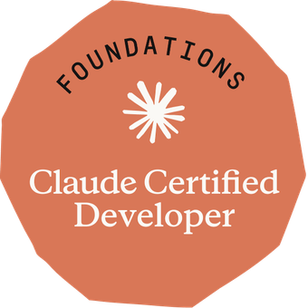

# Passing the CCDV-F Exam

This article is manually created by me, without AI assistance :).
I passed the Claude Certified Developer - Foundations (CCDV-F) exam on 19 September 2026 with a score of 926/1000. I wrote down the points that are useful for you if you are preparing for it in the future.

---

## How I Prepared

I spent 5 days, right after acquiring the CCAF (Claude Certified Architect -
Foundations) cert, to prepare for this cert. About 3h per day.

## What Surprised Me

This exam is much easier than CCAF. Both the reading text and the complexity of the question set.

I also did a couple of labs to get used to the coding pattern rather than just
reading. This helped me understand better, and developers are supposed to talk
in code, aren't they? ;).

In addition, the skillcertpro paid exam drills helped make sure my knowledge stuck. I
highly recommend it. You can ping me if you want to have access to the drills I
bought.

All in all, this isn't a difficult exam. If you passed CCAF with a solid score,
CCDV-F should be just fine :). Good luck!

