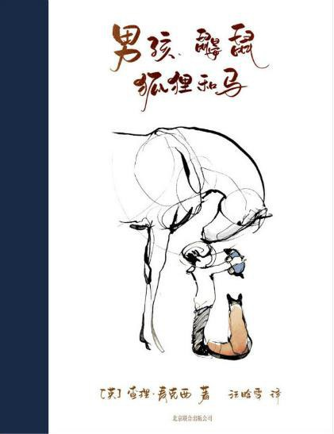

# 男孩、鼹鼠、狐狸和马：我把「相伴」的标准定得太窄了

_[英] 查理·麦克西 著，汪晗雪 译_

这本书薄得令人发指。站在书店里就能翻完。比《小王子》还好读。

《小王子》好歹是个故事。有玫瑰，有星球，有要你去解的谜。这本几乎没有情节。就是四个家伙一路走，一路说些很小的话。

可它告诉我的，比很多厚书都多。

---

## 它太空了，所以装得下你

书里的话简单到你会怀疑。「你长大后想成为什么？」「善良。」就这样。一句，剩下大片留白。

你以为没什么。直到你把自己的日子放进去。

它不往你脑子里塞东西。它让万物穿过自己。你穿过它，看见的是跟自己对上号的那一面。

一百个人读，读出一百种。因为它照的从来不是它自己，是各自的人生。你读到的深刻，其实是你自己的倒影。

---

## 差得那么远，却这么要好

男孩一直在问，一直在怕。鼹鼠贪吃蛋糕，话最多。狐狸很久不说话，受过伤，把牙齿留给太靠近的人。马什么都懂，却从不抢着说。

四个物种。四种脾气。几乎没有共同点。

可他们就是彼此最好的朋友。

让我想起《老友记》那群人。差得那么远，凑在一起就是一家。不同不是麻烦。不同，就是这段陪伴的底色。

---

## 形影相随这件事

有一句一直没散：他们总在一起，肩并肩，谁也不落下。

我二三十岁的时候，特别想要这种朋友。想死死抓住小时候的玩伴。他们说句什么、做件什么，我都看得很重。生怕散了。

现在反而松了。

有机会在一起，当然开心。很久没联系，也不妨害什么。那份关系还在，只是不必天天拿出来证明。

这本书替我发现了一件事：那种朋友没消失。是我以前把「相伴」的标准定得太窄。非要形影相随，才算数。

---

其实不用。

一本薄薄的书，我翻了两遍，大概一个小时，也告诉了我好多。

这也是相伴。过了那个年纪，照样有。
