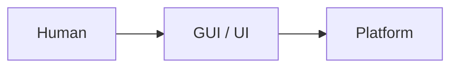
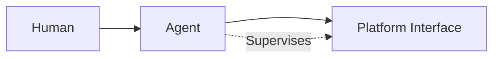
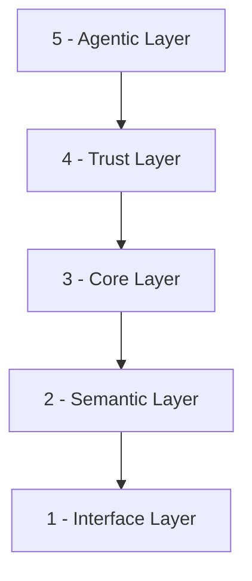

# Salesforce Headless 360: A Paradigm Shift or Just Hype?

I see the same pattern unfolding right now in Salesforce, in AI, in how we build software. And it's happening with the new announced [Headless 360](https://www.salesforce.com/news/stories/salesforce-headless-360-announcement/).

To understand why, let me take you back to the 1950s.

A shipping container was invented. It didn't make cargo ships faster. It didn't make ports more efficient. It killed an entire industry.

Before containers, loading cargo was slow and expensive. Armies of dockworkers handled each unique shipment. Ports had to be customized for every cargo type.

Then containers came. They didn't improve break-bulk. They made it obsolete.

Harbors like London and New York fell. Felixstowe rose to replace London's old docks; Port Newark–Elizabeth replaced Manhattan's piers.

Salesforce's Headless 360 is doing the same thing to the "UI-first" paradigm.

The new agent world isn't from **A** to **A+**. It's **A** dying and an unprecedented **B** appearing. And I think Salesforce made the right call. User interfaces are dying, whether we like it or not.

**Old world:**

**New world:**

But let's be clear:

**The vision is not enough. The implementation is the key.**

Anyone can say "agent-first." But most get it wrong. I hate it when an agent tells me to go to a link, click a button in the top right, then do this, then do that. Not because the agent wants to, but because the platform doesn't support headless interaction.

I have a simple rule:

*If you remove all the UI, the agent should still be able to do the same work successfully as you did in the past. If it can't, the platform isn't agent-first.*

The hard part isn't saying "agent-first." It's building it and maintaining it in production. To do that right, you need to rethink the entire architecture. Most people start with APIs and stop there. Let's break down the technical layers in my mind:

## 1. Interface Layer

APIs, CLIs, MCPs, skills. The front door that lets agents enter the platform.

[SF CLI](https://developer.salesforce.com/tools/salesforcecli) is developers' best Tooling. Salesforce is famous with diversifed APIs. MCP servers are popping up too. These are the entry points that agents use to interact with the platform. But just having a CLI or an API isn't enough. The interface needs to be designed for agents, not humans who happen to type commands. When an interface has no context, agents start to guess and hallucinate. That's where the next layer comes in.

## 2. Semantic Layer

This is the one everyone skips. Companies think "just expose an API" is enough. But the semantics inside are often terrible. Agents end up guessing, trying multiple paths, and worst of all, triggering side effects they can't see because the interface never explicitly said "this launches a missile to destroy NY city."

Good semantics are the difference between an agent that works and one that "sort of". Think about it:

- CLI tools with really good command and subcommand menus, and flags like `--help`, `--dry-run`, `--json`
- MCP servers with incremental discovery, so agents can explore what's available without guessing
- APIs with rich schema descriptions that explain not just the data structure, but the intent and when to use it
- Machine-readable manifests like `llm.txt` that give agents a clear map of the platform without reading through pages of human documentation

These all serve the same goal: making the interface understandable to machines.

## 3. Core Layer

This is the good-old core of the platform. Flows, Apex, triggers, integrations, the database. The existing business logic that makes Salesforce valuable. But now it needs to be exposed to agents.

The challenge isn't exposing it. Most customer orgs are gigantic monolithic jungles. It was already difficult for developers to catch the big picture and the logic flow. People needed experience and technical documentation to navigate it. So now when the agent comes in, how can it quickly understand all of this? A user clicks a button. That invokes Apex, which fires a trigger, which kicks off a flow, which updates another object, which fires another trigger. And it might wait for approvals, or send notifications. How does an agent trace through that? An agent shouldn't have to guess the path. It should have a clear, logical understanding of what happens.

Long logic chains are bad. But unfortunately, many customers have them. The key difference is that wheter an agent can see the full chain clearly and take cautious, deliberate actions rather than guessing.

## 4. Trust Layer

Yes, platforms start to have agent-friendly auditing and logging. But what people ignore is agent-native observability: logging at a depth humans never would, plus an error-collecting API so agents can submit rich diagnostics when tasks fail. Agents are way more willing to give detailed feedback than humans. If your platform doesn't have a way to ingest that, you're throwing away a huge improvement loop. The diagnostic information collected here gets fed back into the next layer, the Agentic Layer, where platform-owned agents use it to improve the entire system.

## 5. Agentic Layer

Agents that manage the platform itself. Observing and monitoring all incoming agent actions, tracking performance, doing A/B testing, scoring behavior, handling version control, and rolling back, all automatically.

Think of these agents as the admins of this new world. They don't replace human admins. They handle the scale and speed that humans can't. When an agent submits diagnostic data, the Agentic Layer analyzes it, identifies patterns, and triggers improvements. When a new API version is released, it runs A/B tests, scores the impact, and rolls back if needed. These are the platform's self-improving mechanisms.

## The Real Challenge

The hardest layers to build are the Semantic Layer and the Trust Layer. And they're the easiest to ignore.

Without the Semantic Layer, user agents are guessing. Without the Trust Layer, platform agents are blind. These two layers are the difference between an agent-first platform and a gimmick.

Salesforce built its empire on low-code, no-code UIs. That paradigm is ending. For everyone building on the platform, the skills that got you here won't take you there. Just like the container revolution: some harbors find their rebirth and thrive. Others become relics.

Salesforce Headless 360 is a great move. But **the vision is not enough. The implementation is the key.** The real work is in the layers.
