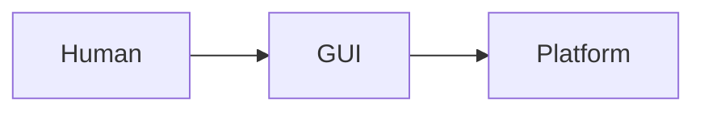
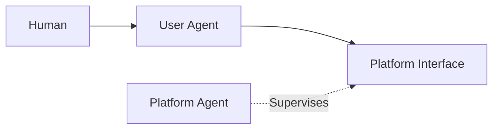
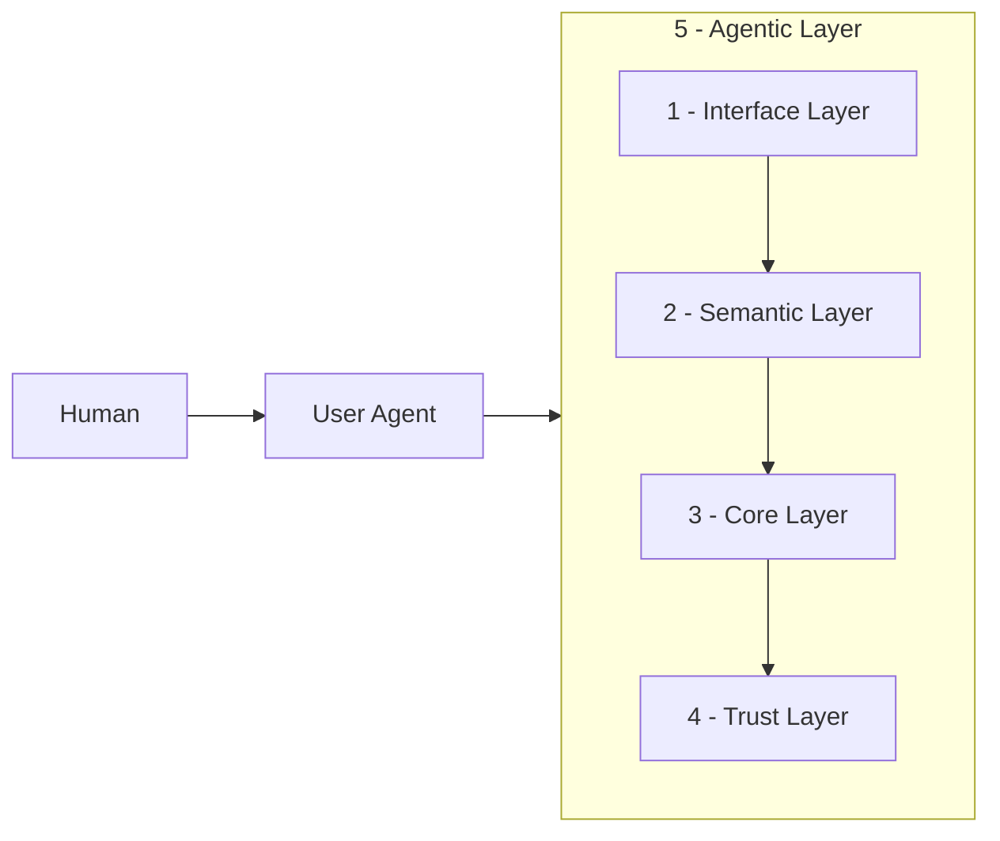

# Salesforce Headless 360: A Paradigm Shift or Just Hype?

The same pattern keeps appearing in the new AI world, in how we build software. It's happening also with the newly announced [Headless 360](https://www.salesforce.com/news/stories/salesforce-headless-360-announcement/).

To understand why, go back to the 1950s.

The shipping container was invented. It didn't make cargo ships faster. It didn't make ports more efficient. It killed an entire industry.

Before containers, loading cargo was slow and expensive. Armies of dockworkers handled each unique shipment. Ports were customized for every cargo type.

Then containers came. They didn't improve break-bulk. They made it obsolete.

Harbors like London and New York fell. Felixstowe rose to replace London's old docks; Port Newark–Elizabeth replaced Manhattan's piers.

Salesforce's Headless 360 is doing the same thing to the "UI-first" paradigm.

The new agent world isn't from **A** to **A+**. It's **A** dying and an unprecedented **B** appearing. GUIs are dying, whether we like it or not.

**Old world:**

**New world:**

But let's be clear:

**The vision is not enough. The implementation is the key.**

Anyone can say "agent-first." But most get it wrong. I hate it when an agent tells me to go to a link, click a button in the top right, then do this, then do that, not because the agent wants to, but because the platform doesn't support headless interaction.

My simple rule:

_If you remove all the UI, the agent should still be able to do the same work. If it can't, the platform isn't agent-first._

The hard part isn't saying "agent-first." It's building and maintaining it in production. That requires rethinking the entire architecture. Most people start with APIs and stop there. Here are the five layers that matter:

## 1. Interface Layer

APIs, CLIs, MCPs, skills. The front door that lets user agents enter the platform.

SF CLI is a strong tool. Salesforce has diverse APIs. MCP servers are emerging too. But having an interface isn't enough. It must be designed for agents, not humans who happen to type commands. Without context, agents guess and hallucinate. That's where the next layer comes in.

## 2. Semantic Layer

This is the one everyone skips. Companies think "just expose an API" is enough. But the semantics inside are often terrible. Agents end up guessing, trying multiple paths, and triggering side effects they can't see, because the interface never said "this action is irreversible."

Good semantics are the difference between an agent that works and one that sort of works:

- CLI tools with clear command menus and flags like `--help`, `--dry-run`, `--json`
- MCP servers with incremental discovery, so agents explore what's available only when they need
- APIs with rich schema descriptions that explain intent, not just structure
- Machine-readable manifests like `llm.txt` that map the platform without pages of human docs

The goal is the same: make the interface understandable to machines.

## 3. Core Layer

Flows, Apex, triggers, integrations, the database. The existing business logic that makes Salesforce valuable, now exposed to agents.

The challenge isn't exposure. Most customer orgs are monolithic jungles. A click invokes Apex, which fires a trigger, which kicks off a flow, which updates another object, which fires another trigger, which waits for approvals. Developers needed years of experience to navigate this. Agents need a clear, logical path, not a maze to guess through.

Long logic chains are dangerous for agents. The key isn't eliminating them. It's ensuring agents can trace the full chain and act deliberately.

## 4. Trust Layer

Platforms are adding agent-friendly auditing and logging. But what most ignore is agent-native observability: deep logging humans would never bother with, plus an error-collecting API so agents can submit rich diagnostics when tasks fail. Agents are far more willing to give detailed feedback than humans. If the platform can't ingest that, it's wasting a powerful improvement loop. The data from this layer feeds directly into the Agentic Layer above.

## 5. Agentic Layer

Agents that manage the platform itself: monitoring incoming agent actions, tracking performance, running A/B tests, scoring behavior, handling version control, and rolling back automatically.

These are the admins of the new world. They don't replace human admins. They handle the scale and speed humans can't. When diagnostic data arrives, they identify patterns and trigger improvements. When a new API version ships, they test, score, and roll back if needed.

## The Real Challenge

The hardest layers to build are the Semantic Layer and the Trust Layer. And they're the easiest to ignore.

Without the Semantic Layer, user agents are guessing. Without the Trust Layer, platform agents are blind. These two layers are the difference between an agent-first platform and a gimmick.

Salesforce built its empire on low-code, no-code UIs. That paradigm is ending. The skills that got you here won't take you there. Just like the container revolution: some harbors adapt and thrive. Others become relics.

Salesforce Headless 360 is a good move. But **the vision is not enough. The implementation is the key.** The real work is in the layers.
