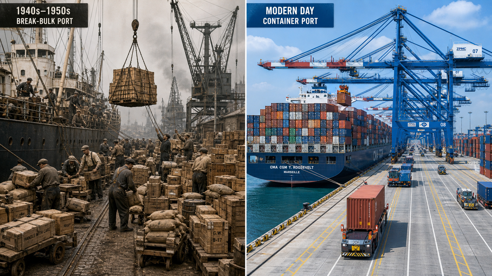
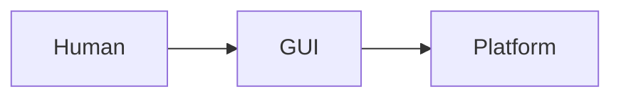
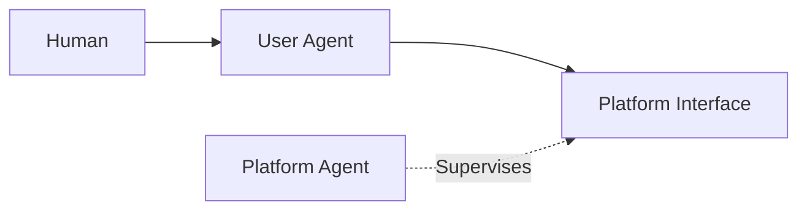
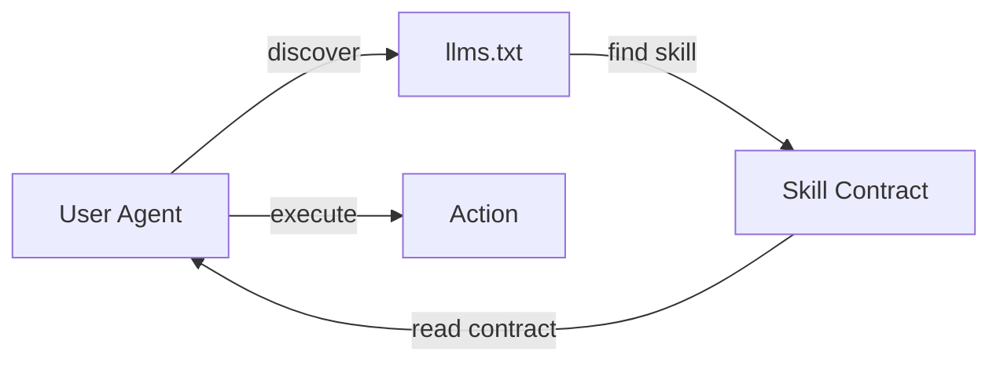
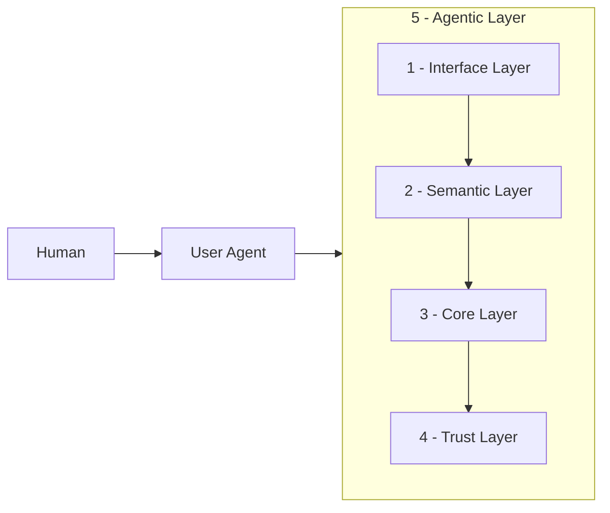
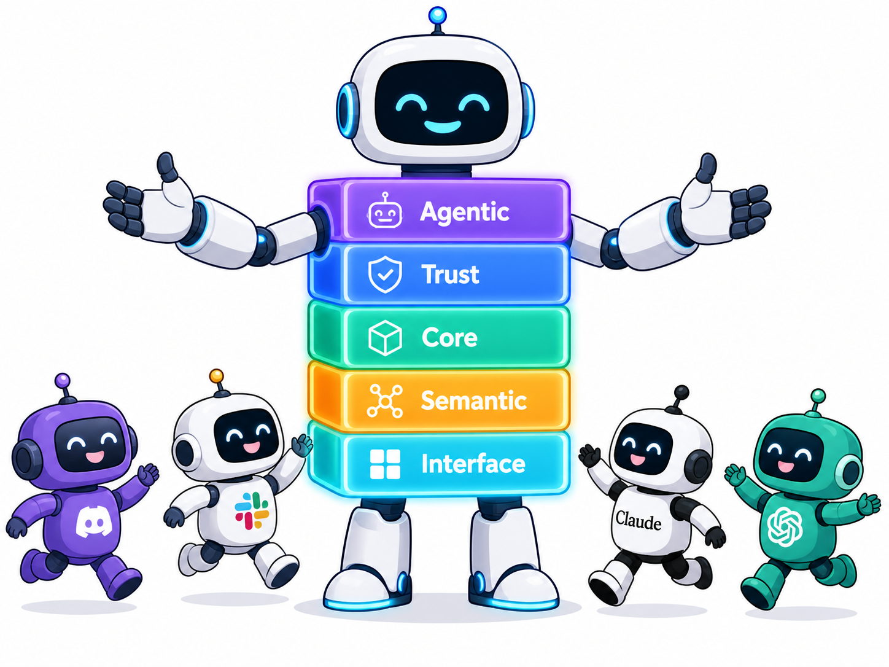

# Salesforce Headless 360: A Paradigm Shift or Just Hype?

User agents are multiplying. Quietly. Everywhere.

Claude books meetings. Copilot writes code. Support tickets close without anyone opening a browser.

This is why Salesforce announced [Headless 360](https://www.salesforce.com/news/stories/salesforce-headless-360-announcement/). Not to improve the existing platform. To survive what's coming.

Because this isn't **A** to **A+**. It's **A** dying and an unprecedented **B** appearing. In Salesforce, A is the no/low-code GUI. B is the user agent.

That distinction is why this article exists.

---

To understand why, go back to the 1950s.

The shipping container didn't make ships faster. Didn't make ports more efficient. It killed an entire industry.

Before containers: armies of dockworkers, every cargo type handled by hand, every port built differently.

Then containers came. They didn't improve break-bulk. They made it obsolete.

London's docks collapsed. New York's piers emptied. New ports rose. Not where the old ones stood. Somewhere else entirely.

---

Salesforce's Headless 360 is doing the same thing to the GUI-first paradigm.

The old world isn't gone (yet). But it's no longer where the platform is heading.

**Old world:**

**New world:**

But a user agent isn't just a faster human clicking buttons. It's a different beast entirely.

It doesn't browse. It calls. No GUI to confirm. No human in the loop to catch a wrong turn.

You've been there. An agent tells you to go to a link, click a button in the top right, then do this, then do that. Not because the agent wants to. Because the platform doesn't support headless interaction.

My simple rule:

_If you remove all the GUI, the agent should still be able to do the same work. If it can't, the platform isn't agent-first._

A user agent reasons through multi-step sequences on its own. It carries context across every action. It decides, executes, and moves on. Platforms were never built for any of that.

---

A new beast needs a new foundation. Two things make or break it:

**Semantics.**

Agents can't guess intent. They have no visual cues, no hover states, no tooltips. Without machine-readable context, they hallucinate paths, retry blind, and trigger side effects no one planned for.

Many platforms ship CLIs, APIs, MCPs, and skills. They call it "agent-first". It's an important step. But it's missing the soul.

The soul is semantics.

A good CLI doesn't just expose commands. It tells agents what to expect:

- `--help` with clear, structured output
- `--dry-run` for any action with side effects
- `--json` for machine-readable responses
- Clean stdout, stderr, and exit codes
- Good examples. LLMs love examples.

APIs follow the same logic. The interface and the meaning.

- Schema descriptions that explain intent, not just structure
- Reversibility signals. Agents can't read warning modals.
- Structured errors: retry, escalate, or abort
- Idempotency keys. Agents retry. Without them, retries create duplicates.

MCP servers should expose a minimal contract. Not everything at once. Let the agent explore when it needs to. Fewer tools visible = less noise = sharper decisions.

Agent skills are different. Each feature gets its own skill. For example, a user agent needs to create a flow. It finds the flow creating skill via `llms.txt`. Reads the contract: inputs, outputs, side effects. Knows exactly what format to pass. No guessing. No docs to scrape.

The goal isn't coverage. It's clarity.

**Observability.**

Agents don't interact with the platform like humans. They interact constantly. Thousands of actions where a human might take one. That volume demands auditing and logging at a scale no human admin can process.

The data is there. The problem is who reads it. No human can keep up. The platform needs to put agents in the admin role too. Monitoring what's happening. Flagging anomalies. Catching what no one would catch manually.

These two challenges shaped how I think about platform design. Five layers.

---

## 1. Interface Layer

APIs, CLIs, MCPs, skills. The front door that lets user agents enter the platform.

Having an interface isn't enough. It must be designed for agents, not humans who happen to type commands. Without context, agents guess and hallucinate. That's what the next layer fixes.

## 2. Semantic Layer

This is the one everyone skips. Companies think exposing an interface is enough. But an interface without meaning is a trap. Agents guess, retry blind, trigger side effects no one planned for.

Good semantics tell agents what to expect, what's reversible, what to avoid. The interface and the meaning. That's what makes an agent reliable, not just capable.

The specifics are in the Semantics section above.

## 3. Core Layer

The data model, automations, custom business logic. Everything that already exists in the platform and makes it valuable.

This is the moat. Years of customer configuration, flows, Apex, integrations, all locked into Salesforce. That doesn't disappear. It gets exposed to agents, cleanly, through the Semantic Layer above.

But most orgs are monolithic jungles. A user clicks a button. That invokes Apex, which fires a trigger, which kicks off a flow, which updates another object, which fires another trigger, which waits for approvals, which sends notifications.

The ideal: the core is detangled. Functionalities composable. Agents pick what they need and chain it themselves.

The reality: most orgs carry that technical debt. That's fine, as long as the agent can see the full chain clearly. Not guess it. See it. Then it can act deliberately.

## 4. Trust Layer

Auditing, logging, error collecting. The platform's record of everything user agents do.

Most platforms stop at logging. But agents can do something humans never bothered with: submit rich diagnostics when something goes wrong. Exact inputs, the decision path, the error. Not a vague report. A full trace.

For that to work, the platform needs to provide the channel. An API for agents to submit feedback directly. Not passive logs waiting to be scraped. Active submission, by design.

Software doesn't survive by grand roadmaps. It survives by evolving toward what users actually need, one fix at a time. Agents generate the richest signal of what's failing and what matters. That trace is gold.

## 5. Agentic Layer

This layer sits on top of everything else. It's the platform watching itself.

Agents that monitor incoming actions, track performance, run A/B tests, roll back automatically.

These are the admins of the new world. Not replacements for human admins. They handle the scale and speed no human can.

Diagnostic data arrives. They find the pattern. They trigger the fix. A new API version ships. They test, score, and roll back if needed. No delay.

---

## Wrap Up

The Semantic Layer and the Trust Layer are unlike anything the platform has built before. And they're the easiest to ignore.

Salesforce built its empire on low-code, no-code UIs. That paradigm is fading. The skills that got you here won't take you there. Just like the container revolution: some harbors adapt and thrive. Others become relics.

Salesforce Headless 360 is a good move. But **the vision is not enough. The implementation is the key.** The real work is in the layers.

