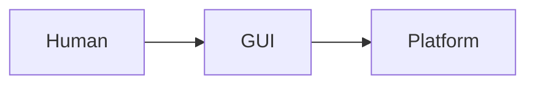
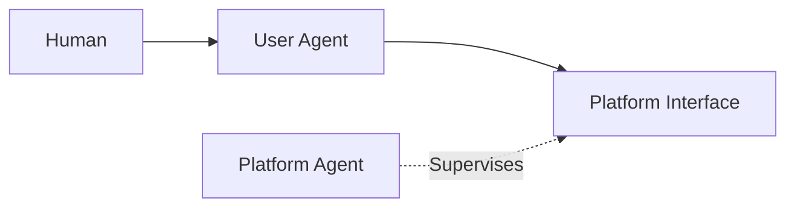
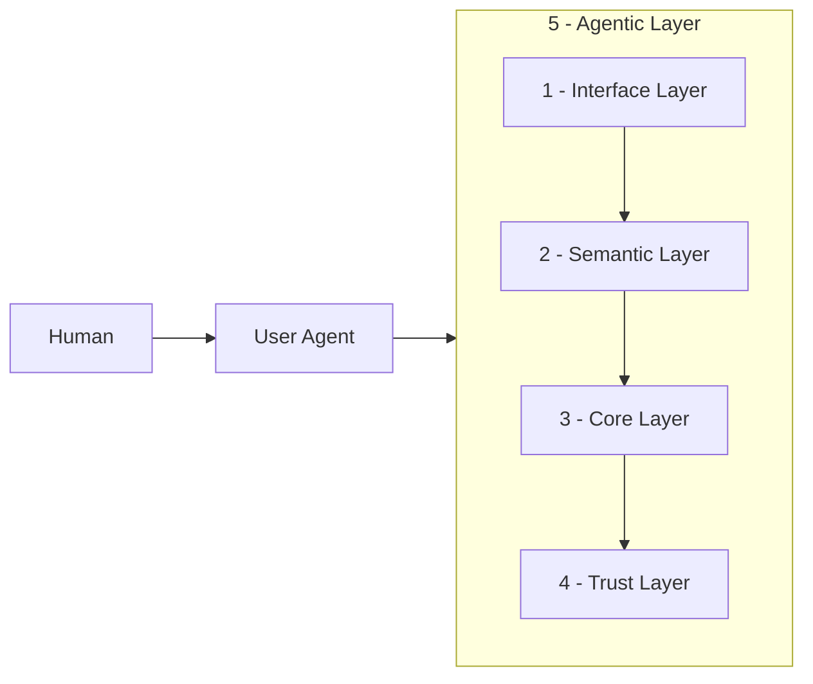

# Salesforce Headless 360: A Paradigm Shift or Just Hype?

User agents are multiplying. Not overnight. Steadily, firmly, and without asking permission.

Claude books meetings. Copilot writes code. Custom agents close support tickets without anyone opening a browser. Each month, more work that used to require a GUI gets done without one.

This is why Salesforce announced [Headless 360](https://www.salesforce.com/news/stories/salesforce-headless-360-announcement/). Not to improve the existing platform. To survive what's coming.

Because this isn't **A** to **A+**. It's **A** dying and an unprecedented **B** appearing. In Salesforce, A is the no/low-code GUI. B is the user agent.

To understand why, go back to the 1950s.

The shipping container didn't make ships faster. Didn't make ports more efficient. It killed an entire industry.

Before containers: armies of dockworkers, every cargo type handled by hand, every port built differently.

Then containers came. They didn't improve break-bulk. They made it obsolete.

London's docks collapsed. New York's piers emptied. Felixstowe and Port Newark rose in their place.

Salesforce's Headless 360 is doing the same thing to the GUI-first paradigm.

The old world isn't gone. But it's no longer where the platform is heading.

**Old world:**

**New world:**

But a user agent isn't just a faster human clicking buttons. It's a different beast entirely.

It doesn't browse. It calls. No GUI to confirm. No human in the loop to catch a wrong turn.
I hate it very much when an agent tells me to go to a link, click a button in the top right, then do this, then do that. Not because the agent wants to. Because the platform doesn't support headless interaction.

My simple rule:

_If you remove all the GUI, the agent should still be able to do the same work. If it can't, the platform isn't agent-first._

It reasons through multi-step sequences on its own. It carries context across every action. It decides, executes, and moves on. Platforms were never built for any of that.

A new beast needs a new foundation. Two things make or break it:

**Semantics.**

Agents can't guess intent. They have no visual cues, no hover states, no tooltips. Without machine-readable context, they hallucinate paths, retry blind, and trigger side effects no one planned for.

Many platforms ship CLIs, APIs, MCPs, and skills, and call it "agent-first". It's an important step. But it's missing the soul.

The soul is semantics.

A good CLI doesn't just expose commands. It tells agents what to expect:

- `--help` with clear, structured output
- `--dry-run` for any action with side effects
- `--json` for machine-readable responses
- Clean stdout, stderr, and exit codes
- Good examples. LLMs love examples.

APIs follow the same logic. The interface and the meaning.

- Schema descriptions that explain intent, not just structure
- Reversibility signals. Agents can't read warning modals.
- Structured errors: retry, escalate, or abort
- Idempotency keys. Agents retry. Without them, retries create duplicates.

MCP servers should expose a minimal contract. Not everything at once. Let the agent explore when it needs to. Fewer tools visible = less noise = sharper decisions.

Agent skills are different one from another. Each feature gets its own skill. For example, a user agent needs to create a flow. It finds the flow creating skill via `llms.txt`. Reads the contract: inputs, outputs, side effects. Knows exactly what format to pass. No guessing. No docs to scrape.

The goal isn't coverage. It's clarity.

**Observability.**

Agents don't interact with the platform the way humans do. They interact constantly. Thousands of actions where a human might take one. That volume demands auditing and logging at a scale no human admin can process.

The data is there. The problem is who reads it. No human can keep up. The platform needs to put agents in the admin role too. Monitoring what's happening. Flagging anomalies. Catching what no one would catch manually.

These two challenges shaped how I think about platform design. Five layers.

## 1. Interface Layer

APIs, CLIs, MCPs, skills. The front door that lets user agents enter the platform.

SF CLI is a strong tool. Salesforce has diverse APIs. MCP servers are emerging too. But having an interface isn't enough. It must be designed for agents, not humans who happen to type commands. Without context, agents guess and hallucinate. That's where the next layer comes in.

## 2. Semantic Layer

This is the one everyone skips. Companies think "just expose an API" is enough. But the semantics inside are often terrible. Agents end up guessing, trying multiple paths, and triggering side effects they can't see, because the interface never said "this action is irreversible."

Good semantics are the difference between an agent that works and one that sort of works:

- CLI tools with clear command menus and flags like `--help`, `--dry-run`, `--json`
- MCP servers with incremental discovery, so agents explore what's available only when they need
- APIs with rich schema descriptions that explain intent, not just structure
- Machine-readable manifests like `llm.txt` that map the platform without pages of human docs

The goal is the same: make the interface understandable to machines.

## 3. Core Layer

Flows, Apex, triggers, integrations, the database. The existing business logic that makes Salesforce valuable, now exposed to agents.

The challenge isn't exposure. Most customer orgs are monolithic jungles. A click invokes Apex, which fires a trigger, which kicks off a flow, which updates another object, which fires another trigger, which waits for approvals. Developers needed years of experience to navigate this. Agents need a clear, logical path, not a maze to guess through.

Long logic chains are dangerous for agents. The key isn't eliminating them. It's ensuring agents can trace the full chain and act deliberately.

## 4. Trust Layer

Platforms are adding agent-friendly auditing and logging. But what most ignore is agent-native observability: deep logging humans would never bother with, plus an error-collecting API so agents can submit rich diagnostics when tasks fail. Agents are far more willing to give detailed feedback than humans. If the platform can't ingest that, it's wasting a powerful improvement loop. The data from this layer feeds directly into the Agentic Layer above.

## 5. Agentic Layer

Agents that manage the platform itself: monitoring incoming agent actions, tracking performance, running A/B tests, scoring behavior, handling version control, and rolling back automatically.

These are the admins of the new world. They don't replace human admins. They handle the scale and speed humans can't. When diagnostic data arrives, they identify patterns and trigger improvements. When a new API version ships, they test, score, and roll back if needed.

## The Real Challenge

The hardest layers to build are the Semantic Layer and the Trust Layer. And they're the easiest to ignore.

Without the Semantic Layer, user agents are guessing. Without the Trust Layer, platform agents are blind. These two layers are the difference between an agent-first platform and a gimmick.

Salesforce built its empire on low-code, no-code UIs. That paradigm is ending. The skills that got you here won't take you there. Just like the container revolution: some harbors adapt and thrive. Others become relics.

Salesforce Headless 360 is a good move. But **the vision is not enough. The implementation is the key.** The real work is in the layers.
