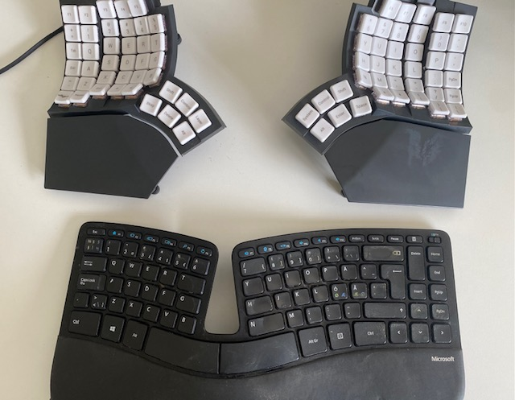
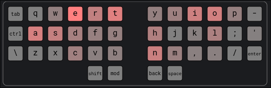
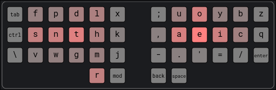
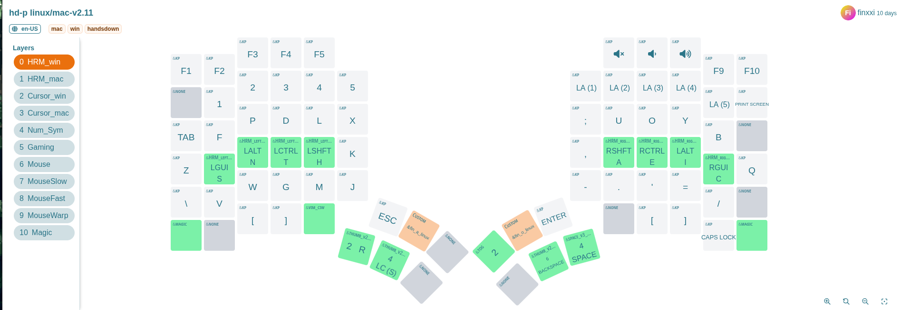

# My Ergonomic Keyboard Journey: From Sculpt to Glove80

For years I used a regular keyboard until shoulder and hand tension pushed me to
try something better. I switched to the **Microsoft Sculpt**, which served me
well for several years. It was a big step up for comfort, but eventually I
wanted to explore something even more ergonomic.

---

## Choosing the Next Keyboard

I started comparing modern ergonomic split keyboards:

- **Kinesis Advantage360** – classic reputation, but a bit pricey and bulky.
- **Voyager** – high-quality build, very compact, but too minimal key count for
  me.
- **Moonlander** – modern design, highly customizable.
- **Glove80** – wireless, lightweight, with a distinctive curved key layout.

After weighing the pros and cons, I chose the **Glove80**. Looking back, I
believe any of these would have been a massive improvement over my Microsoft
Sculpt—let alone a standard laptop keyboard.

My **Glove80** (top) and retired **Sculpt** (bottom).

---

## Changing the Layout Too

At the same time, I took on another challenge: moving from **QWERTY** to the
**Hands Down** layout. My motivation was better efficiency, less finger strain,
and more natural hand movement.

There are more traditional alternatives like **Dvorak** and **Colemak**, but I
chose the more modern and thumb-friendly **Hands Down** family—specifically the
*handsdown-promethium* variant.

You can find more handsdown info
[here](https://sites.google.com/alanreiser.com/handsdown).

1. Our most familiar QWERTY layout:

2. My chosen handsdown-promethium layout:

So, not only did I have to adjust to a new keyboard shape, but also to a
completely new key layout. Yes, it was brutal, painfully difficult at first.

That said, I’m very happy with handsdown-promethium. Honestly, I think almost
any modern layout is a huge step up from QWERTY. [This
site](https://cyanophage.github.io/) provides useful statistics on different
layouts to back that up. For example,
[QWERTY](https://cyanophage.github.io/#qwerty)'s *Total Word Effort* is 2070.6
while [handsdown-promethium](https://cyanophage.github.io/#handsdown-promethium)
is only 763.5.

---

## Programmability and Practice

One of the Glove80’s best features is its **programmability**. I could remap
keys, add layers, and customize shortcuts directly on the keyboard. These three
features make it possible to tailor the keyboard to my workflow instead of
forcing myself to adapt to it.

### Layers

A **layer** is like having multiple keyboards in one. Your base layer handles
normal typing, but with a single key press you can switch to another layer—for
numbers, symbols, navigation, or anything else. On the Glove80, I set up
separate layers for symbols, numbers, cursor movement, and even mouse control.
With cursor keys and mouse emulation built in, I rarely reach for an actual
mouse—especially when using a tiling window manager like Hyperland.

### Home Row Mods (HRM)

Another powerful feature is **Home Row Mods**. With HRM, keys on the home row
act as normal letters when tapped, but as modifiers (Ctrl, Alt, Shift, etc.)
when held.

In my case, `s`, `n`, `t`, `h` on left hand and `a`, `e`, `i`, `c` on righe hand
are my modifiers as shown on the glove80-layouts screenshot above.

This means I don’t need to stretch my fingers awkwardly to reach modifier keys,
reducing strain and speeding up key combos.

---

## The Practice Phase

The first few weeks were slow. I had to **retrain my muscle memory** while
learning both a new keyboard shape and a new layout. Daily practice on
[keybr.com](https://www.keybr.com/) was essential. Gradually, my typing speed
and accuracy started to recover.

---

## Integrating Into My Workflow

Once typing felt natural again, the next step was adapting my **dotfiles** and
tools. For me, that especially meant reconfiguring **Tmux** and **Neovim** to
fit the new layout. Even small adjustments made a big difference in keeping my
workflow smooth and efficient.

One challenge of using a non-QWERTY layout is **Vim’s navigation keys**.
Traditionally, `h`, `j`, `k`, and `l` sit comfortably on the home row, making
them ideal for movement. On Handsdown-Promethium, however, these keys are no
longer in the same resting positions, so an alternative was needed.

My solution was to rely on the **arrow keys in a dedicated cursor layer**. On
the Glove80, they map neatly to the same physical positions as `hjkl` on a
standard keyboard, which makes the transition more natural. At the same time,
Handsdown-Promethium still places `hjkl` in reasonably accessible spots, so I
can fall back on them if I want.

This hybrid approach has worked well: I get the familiarity of Vim-style
navigation without forcing my fingers into awkward positions.

---

## Typing Demo

[Here’s a 1.5-minute typing demo](https://youtu.be/k6qzg6YJ-pY) ~40 WPM (words per min) recorded on 13-09-2025.

Notes:
- The printed letters on the keycaps are QWERTY, so they don’t match my actual layout.
- Finger and hand movement is very minimal, which shows the ergonomic advantage.

---

## Final Thoughts

Switching from the Sculpt to the Glove80—while also changing layouts—was not
easy. The transition took multiple weeks of patience and practice.

But now, three months later, typing feels **lighter, smoother, and more
sustainable**. I no longer feel the same tension in my shoulders and hands.

If you spend hours typing each day, investing in both an ergonomic keyboard and
a better layout is worth it. The short-term pain pays off in long-term comfort
and efficiency.

