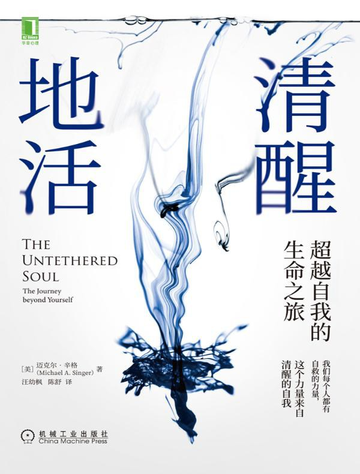
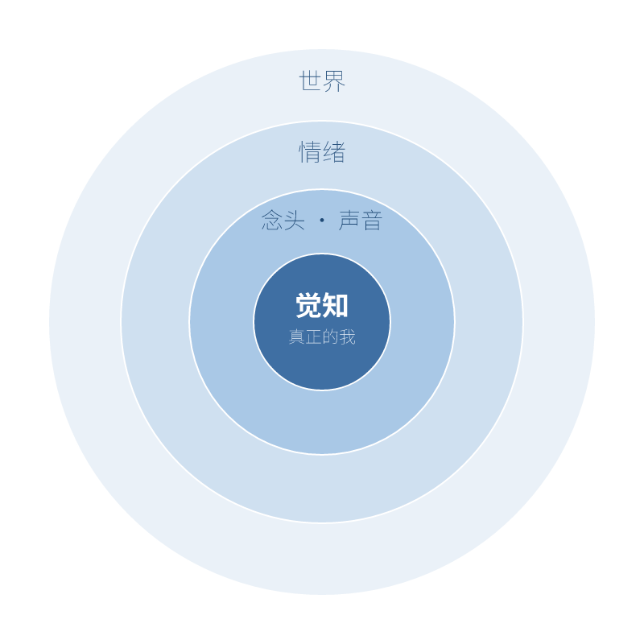

# 我不是那个声音

> **推荐** ★★★★★（5 / 5）
> **读于** Kindle 电子书
> **语言** 中文

给它五星。

这本书给了我一个全新的概念，像推开一扇门，门后是一个我从没见过的世界。它还顺手把我过去做过、却一直没底气的一些事，稳稳地扎下了根。

如果你喜欢自我成长或灵修类的书，我想它在你那儿至少值四星。对我，它是不折不扣的五星。

---

## 你不是脑海里那个声音

你跟父母大吵了一架。吵的那会儿，有个声音在你脑子里说：日子没法这么过下去了，又累，又糟，一切都糟透了。

可火气一散，几个钟头后，你跟他们聊了几句，才发现其实没那么糟。那个声音又开始说：生活挺好。

这几个小时里，外面的事一件没动。倒是你的情绪，从一头荡到了另一头。

这两头的情绪，其实都是同一个声音说给你听、再替你拍板的。它跳，它动不动就上头，还常常没什么道理。你从出生第一天起，就一直听它调遣。

那个一会儿唱衰、一会儿又打气的家伙，你停下来看过它一眼吗？

这本书（迈克尔·辛格《清醒地活》）其实只讲了一件事，就在前两章：**你不是脑海里那个声音。** 后面所有章节，都是在为这一句话做论证、做铺垫、做验证。

先得让你认出这个声音。它是谁？

它情绪化，爱猜，而且总往坏处猜。讲件我自己的事。

有一次坐地铁，对面坐下一个中东面孔的陌生人。我脑子里那个声音立刻响了：小心点，这种人不好惹。于是我下意识跟他拉开距离，躲着他的眼神。

坐着坐着，不知怎么就聊上了，几句闲话。结果他外向、健谈，是个特别有意思的人。

就在那一刻，声音对他的态度整个翻了过来。

你看，这个人从头到尾什么都没变。变的，只有我脑子里那个声音。

读到这，我心里咯噔了一下。

因为这是我读过的书里，第一次有人把"真正的我"和"那个声音"切开，当成两样东西。以前读的所有书，默认的都是同一件事：我，就等于我的声音，加上我的情绪，加上我的念头，加上身上一切的感受，全打包成一个"我"。从没有人跟我说，这中间可以有一道缝。

那到底哪个才是我？

书给的答案是：觉知。那个在看、在听、在知道的，才是你。

其余的，都是被你觉知到的东西，只是离你远近不同。念头和声音贴得最近，近到你几乎以为它就是你。情绪稍远一点。外面的世界，那些人、那些事，离你最远。

你在正中心。往外一圈是念头，再一圈是情绪，最外一圈是世界。它们都从你面前经过，没有一个是你。

这个说法很新鲜。而且，它说得通。

就凭这一点，我想往下读。

## 别的书处理情绪，这本先处理声音

市面上讲情绪的书，几乎都停在情绪这一层。教你怎么消化愤怒，怎么安抚焦虑，怎么跟难过相处。

但情绪，其实是下游。

回到刚才吵架那一幕：先是声音说"日子没法过了"，你才跟着觉得糟。声音在前，情绪在后。是那句话，点着了那团情绪。

再看一眼上面那张图。声音离你最近，情绪比它更远一圈。你去处理情绪，是在跟最外圈较劲，可真正拨动它的那只手，在里圈。

这本书把顺序倒过来。它说，先处理声音。

以前我一直不太明白，冥想到底图什么。坐在那儿，什么都不干，然后呢？说是能静心，可静下来之后要去哪，没人跟我讲清楚。

这本书头一回给了我一个站得住的理由。

冥想的时候，我能清清楚楚看见：那个声音在讲一个又一个故事。而我，学着坐到一旁，看着它、听着它，像在看另一个人。它是它，我是我。

那个声音不是我，我只是在体验它。它能停，做对了，它真能静下来，静到一个念头都没有。它也能吵，吵得像大多数人脑子里那样，一刻不歇。静也好，吵也好，它都只是我此刻觉知到的一样东西，跟窗外的风、手里的凉意没什么两样。一件我正在经历的事，仅此而已。

这件事，就是在练。一遍遍地看，一遍遍地分开，练成肌肉记忆。

等回到真实生活里，声音又开始编故事的时候，这块肌肉记忆就派上用场了。我能更快把它和真正的我分开，而不是一头栽进它的故事里。

## 一旦陷进去，你拉不出自己

为什么要一直练，练两下不能收工？

因为把你卷走的力道，有强有弱。

拿看电影说。一个好故事，配上画面，配上声音，就足够把你拽进去。灯一暗，你忘了自己坐在影院里，跟着银幕又哭又笑。

那要是再加上气味呢？加上触感呢？故事再好一点，好到你的念头和情绪都跟着它同步起伏？

我想，绝大多数人会彻底陷进去，忘了外面还有个真实世界。

电影散场，灯亮了，你才回来。可在那两个钟头里，真正的我，是丢了的。

这里有个让我后背发凉的地方：一旦陷了进去，那个真正的我，几乎没法靠自己把自己拽出来。

结局只有两种。要么你从一开始就没丢，一直守着中间那个我。要么你就一直丢着，直到电影散场、那股沉浸自己退掉。

中途醒来？很难。所以真功夫不在陷进去之后，在还没陷进去之前。

电影是无害的版本。换个场景，同一套机制就能要命。

想想那些激情杀人的人。跟人吵起来，动了手，那一刻怒到极点，失手把对方打死了。等他从那股情绪里回过神，多半悔得肠子都青了。

可回过神来，已经太晚。真正的我，早在动手之前就丢了，深深陷在那股怒里。等它退潮，人没了，事也成了。

这就是为什么，我们得刻意去练：把真正的我，从声音里、从那股上头的劲里，认出来。

练出来了，被卷下去的时候，你至少还剩一线机会，把自己拉回来。练得再好一点，你在一开始就不接那个声音的话，因为你认得出：它不讲道理，它神经质。

## 声音想保护你，却把你封住了

书里还讲了一样东西：我们身体里的能量。

作为中国人，这个我不难接受。气，经络，丹田，我们从小听到大。能量在体内流动，这套说法，东方讲了几千年。

书把这股能量，跟那个声音接上了。

声音成天替你判断：这个好，那个坏；这个安全，那个危险。它是好意，它想护着你，帮你躲开会疼的东西。

可你有没有想过，正是这一句句"这个不行"，把你圈住了。

它每划一条"这里危险，别碰"的线，你的世界就小一圈。声音以为自己在保护你，其实是在替你设界。

更麻烦的是，这些界还会堵住那股能量。你一收缩、一防备、一关上，气就不流了，堵在那儿。

书给的方子，反直觉：别去加固这些界，把它们松开。敞开，让能量重新流起来。

## 让声音当顾问，别让它当老板

换个更顺手的比方：那个声音，像一个大语言模型。

它们像到骨子里。生成式 AI，你只喂它一个开头、一个词，它就顺着往下续，一句、一段、一整篇，停不下来。脑子里那个声音也一样：生活里随便给它一个由头，它立刻接上，自动往下编，一路生成，不用你催，也停不住。

你可以让它出主意，列选项，抛观点。它反应快，见得多，用好了是把好工具。

但你不会让一个大语言模型替你过完这一生。它给的是参考，不是命令。真正拍板的，永远是你。

对那个声音也一样。听它说，但别让它做主。它建议，你决定。你才是坐在最中间、握着方向盘的那个人。

所以对它，你得看得清清楚楚：它好在哪，坏在哪。它能给你速度和选项，也会塞给你偏见、带你上头。这两面都看透了，你才使得动它，而不是被它使唤。

一旦你把方向盘交出去，你就成了乘客，被它载到哪算哪。

## 剩下的，留给你自己去翻

书里还有很多没细讲的东西。我挑几样点一下，勾起你的兴趣就行，剩下的留给原书。

关于放开。业力不分好坏，正的负的，都得松手。佛家说"放下一切"，说的就是这个。方法朴素得可疑：放松，原谅，大笑。

关于循序渐进。先在小事上练，练顺了再上大一点的事，最后才是真正难的那种。整本书读下来，感觉像在教人戒烟：道理一句话说得清，做起来是场持久战。

关于当下。跟已经发生的事较劲，是跟自己过不去；为还没来的事操心，是白烧能量。你唯一站得住的地方，是此刻。

关于向死而生。想象死亡随时会来。到那一刻，你没有什么更想做却没做的事，也没为谁、为什么跟自己做过妥协。能这样活，才配叫清醒地活。

这些我都只点到为止。真想尝那口味道，去读原书。我真心推荐。

## 合上书

道理简单到一句话就说完：你不是那个声音。

难的是做到。它要你几乎时时刻刻都在练，练一辈子。

只有当你真的认定，这是这辈子最要紧的一件事，你才肯为它花这么多功夫，一天一天练下去。

《道德经》里有一句，正好说这种事：

> 上士闻道，勤而行之；中士闻道，若存若亡；下士闻道，大笑之。不笑不足以为道。

上等人听见这个道理，转身就埋头去做。中等人听了，半信半疑，今天记着明天又忘。下等人听了，哈哈大笑，觉得荒唐。老子接着说：正因为会招这种人笑，它才配叫"道"。

不过这里有件幸运的事。真走上去，你会慢慢和别人不一样：别人拼了命想要的，你不再想；别人躲着、抗拒的，你反而全盘接住。你开始朝着跟大多数人相反的方向走。

老子也写过这种孤独：

> 众人熙熙，如享太牢，如春登台。我独泊兮，其未兆，如婴儿之未孩……俗人昭昭，我独昏昏；俗人察察，我独闷闷……我独异于人，而贵食母。

大伙儿兴高采烈，像赴盛宴，像春日登台看景。我却淡淡的，没什么反应，像个还不会笑的婴儿。别人精明，我糊涂；别人事事算得清清楚楚，我偏闷声不响。我就是跟人不一样，因为我看重的，是那个滋养万物的源头。

看起来像吃亏，像犯傻。可你心里清楚，你贴着的是源头。

那就够了。
