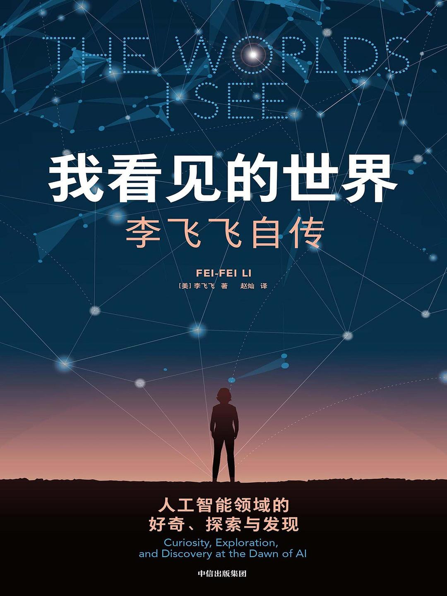

# 我看见的世界：一个移民，和她的北极星

> **推荐** ★★★½☆（3.5 / 5）
> **读于** 有声书 · 微信读书
> **语言** 中文

先谢 Lisa。她推荐了这本书，我才开始听。

也是因为这本，我才发现微信读书的 AI 听书已经这么顺。更要紧的是，它不挑 IP。喜马拉雅上的有声书，我人在海外，一点开常常就被版权挡在外面。微信读书没有这道墙。

给它 3.5 分，不是书写得不好。是传记我读得太多了，这一本的新鲜感，对我不太够。

但如果你和我一样，对人工智能有兴趣，又刚好喜欢这样一种故事：一个人很早就从中国到了美国，要闯语言关，扛文化的落差，一点点把自己安放进一个全新的社会，那这本书在你那儿，值 4 分。

## 我为什么点开这本书

李飞飞这个名字，在机器学习圈子里绕不开。

但说来惭愧，我对她的认识一直停在一行字上：ImageNet 的作者。仅此而已。我甚至不知道她是在美国出生的 ABC，还是从中国过去的移民。

这本书替我补上了这份好奇。这也是我点开它的最主要原因。

## 命运八分，努力两分

有个朋友问过我一个问题：一个人的一生，命运和努力，各占多少？

我的答案是，八分命运，两分努力。

这本书几乎是这句话的活注脚。

李飞飞的父母，在六七十年代的中国，做了一个极其小众的决定：全家搬去美国。到了之后，日子并不好过。家里很穷，父母基本不会讲英文。她就是在这样的环境里长大的。

书里从头到尾，你都能看到父亲和母亲两种截然不同的性格，一点点落在她身上。

她自己当然也努力。美国那种自由、开放、进取的空气，她尽力去吸收。这是她的那两分。但前提始终是，父母替她做了那个小众的选择，搭好了这座舞台。

没有舞台，努力使不上劲。

## 打动我的，是前半本

说实话，真正打动我的，是这本书的前半部分。

是那个刚到美国、语言不通、想家、家里还很穷的小女孩。她父母一时找不到工作，全家挤在拮据里过日子。

这样的开头，会让很多第一代移民一下子就红了眼圈。因为那也是我们的开头。

我想起自己刚到芬兰的时候。

### 课堂上的沉默

我们班上十几个人，有墨西哥来的，有孟加拉来的，还有几个国家，我已经记不太清了。上课用英语。

有一天，老师说，班上有三个同学的英语还得再进步一下，因为课上总感觉沟通不太顺，能看出来我们没太听懂。

我就是其中一个。我说出来的句子，别人常常听不懂：有时是口音，有时是表达不够地道。

那种课堂，经常要大家讨论一个话题，抛出自己的看法和建议。轮到我，话卡在嘴边，就是说不出一个像样的见解。

后来我慢慢想明白，卡住我的不只是英语。很多时候，我心里其实也没攒下一个足够成形的观点。语言只是那层看得见的壳。壳底下，是更空的东西。

### 自己补的那两寸

意识到问题，就一寸一寸去补。

第一寸，口音。我开始有意识地纠正自己的发音，把话说得让人不费力就能听懂。别小看这件事。你说的内容再好，对方听着累，交流就断在半路上了。

第二寸，见识。别人聊起一个话题，我常常连接都接不住，因为压根没听过。于是我逼自己把知识面铺宽一点，什么都去了解一些，好歹在别人抛过来的时候，我能稳稳接住。

如果说命运是父母替李飞飞搭的那座舞台，那这两寸，就是我自己能挣的那两分。

### 还有芬兰语这道坎

英语勉强能沟通了，第二道坎又立在面前：芬兰语。

这是本地的语言。我又花了不少时间去啃，努力在日常里用起来，点菜、办事、跟邻居搭话。

有一次，我碰上一个歧视外国人的芬兰人。我跟他吵了起来。那一刻我才真切地体会到什么叫书到用时方恨少，一肚子的火，却找不出几个够劲的词把它顶回去。

语言从来不只是沟通的工具。急了，被冒犯了，它还是你自卫的武器。词不够用，你连还嘴都还不利索。

李飞飞只要闯一道语言关。我有两道。

### 从怕冷清，到爱独处

李飞飞在书里，一直想念故乡：那里的亲人、文化、味道，种种。她花了很长时间，才把自己安顿好。

我也一样。

刚来的头两年，周围冷清，没什么人，很多事都得一个人扛。为了驱散那份冷清，我会去找中国同胞，一起吃吃喝喝、热闹热闹。说白了，凑的不是朋友，是热闹。他们未必和我志同道合，但那份人气，能暂时盖过孤独。

后来，不知不觉就变了。没有哪一个具体的节点，是一点一点渗进来的。

如今我反倒很享受独处。它把时间还给我，让我能安静地想事情、学东西、做自己真正想做的事。当年拼命想躲开的冷清，成了我现在最舍不得的东西。

时间把思乡，熬成了自处的能力。

说到这，我有个不算成熟的想法，或者说，是我自己的一点世界观。

一个年轻人，最好离开父母，离开熟悉的家乡，到一个陌生的地方去闯一闯。

我知道很多父母舍不得。他们想把孩子留在身边，给他一个温暖的、随时有依靠的港湾。这份心意没有错。

但这些年走下来，我越来越信一件事：一个完整的人格，是磨出来的，不是护出来的。你得亲自去撞语言、撞文化、撞那些没人替你挡的难堪，才能一块一块把自己拼全。温室里长不出这个。被保护得太好的人，人格里往往空着一块，因为那一块，本该由他自己在外面摔出来。

远离，不是为了逃开父母。是为了有一天，能作为一个完整的人，站回他们面前。

书的前半本，我照见了自己。翻到后半本，李飞飞换了一副面孔：那个想家的小女孩，开始一头扎进一件要改变整个领域的事。ImageNet。

## 后半本，像一场创业

翻到后半本，我脑子里冒出来的两个字，是创业。

ImageNet 从无到有的过程，特别像把一家公司从 0 做到 1，再从 1 做到一万。中间的路我就不铺开讲了。只说一点：李飞飞一路上碰到的坎，几乎每一个，在当时看都像迈不过去的。

更难的是，她几乎得不到支持。周围只有极少数人站在她这边，绝大多数人都不看好。

我只举其中一个例子。

### 井挖好了，就等出水

ImageNet 这个数据库建成之后，还差最关键的一步：一个配得上它的算法，把它的潜力挖出来。

为此，他们办了一场比赛，想把全世界的机器学习团队都吸引过来，比谁能做出那个算法。历经前面九九八十一难，终于走到了最后、也最关键的一刻。井已经挖好了，就等它出水。

可头两年的比赛，始终没有一个团队能拿出那个算法。

这种滋味太难受了。李飞飞和团队一次次挫败，甚至开始怀疑：走到这最后一步，到底还成不成？那是一种悬在悬崖上的感觉，上不去，也不敢往下看。

转机在第三年。神经网络回来了。那一年，ImageNet 彻底爆火。

这感觉，真的和创业一模一样。

你笃定一件事，就拼了命往前走，走在所有人的前头，眼里只有那颗北极星。旁人看不懂，你也没法证明自己是对的。直到有一天，你撞见另一个能和你契合的人，他手里正好握着那块能把拼图补全的碎片。两下一对上，你才敢真正确认：我当初的笃定，是对的。

## 合上书

李飞飞的一生，几乎就是这本书里的两句话。

前半程，是命运替她搭的台。父母那个小众的选择，把她放到了美国，也放进了贫困、语言和思乡里。后半程，是她自己的笃定。认准 ImageNet，在几乎没人看好的时候，一直走到井里出水的那一天。

命运给你起点，你没得选。能走多远，看你认准了什么，又肯为它熬多久。

书我给 3.5 分。可那个想家的小女孩，最后把一片没人相信的荒地，熬成了整个领域的绿洲。这件事本身，五星都装不下，得给六星。
